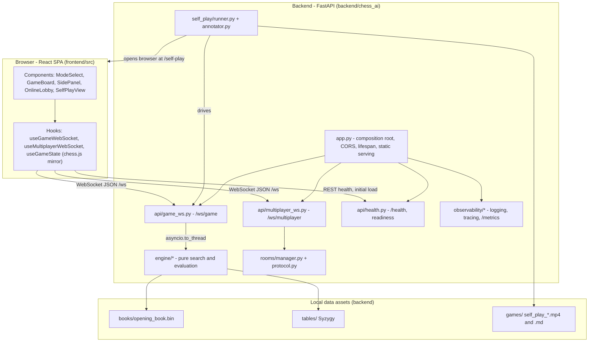

# Technical Specification

# 0. Agent Action Plan

## 0.1 Intent Clarification

The prompt describes a complete, self-contained product rather than a small change to an existing one. This subsection restates that intent in precise technical terms, surfaces the requirements the prompt implies without stating them outright, and records every constraint the build must honor.

### 0.1.1 Core Feature Objective

Based on the prompt, the Blitzy platform understands that the new feature requirement is to build a web-based chess application that lets a person either play against a built-from-scratch chess AI across three difficulty tiers or play a live game against another human in real time. A Python backend owns the chess AI and the authoritative game state. A React and TypeScript single-page application renders the board and communicates with the backend over WebSocket.

The platform reads the explicit feature set as follows:

- Single-player against the AI in three tiers (Easy, Medium, Hard), each with its own search depth and time budget.
- Real-time multiplayer for two human players over a shared WebSocket server, where the server validates and relays every move.
- A hand-built AI engine that combines a Polyglot opening book, a tuned evaluation function, a modern alpha-beta search, and optional Syzygy endgame tablebases.
- A self-play demonstration that pits the AI against itself inside the real browser UI, records the screen to a video file, and writes an annotated, timestamped commentary transcript.
- A single Makefile that drives every operation: setup, development, build, run, self-play, test, lint, format, tablebase download, and clean.

The repository is effectively empty at the start. It holds only a two-line README [README.md:L1-L2] and no source, configuration, or build files, so the platform treats the entire application as the feature to add.

The difficulty tiers are preserved exactly as the user gave them:

| User Example (Difficulty Tiers) | Search Depth | Time Budget |
|---------------------------------|--------------|-------------|
| Easy                            | 4            | 3 seconds   |
| Medium                          | 6            | 8 seconds   |
| Hard                            | 8            | 15 seconds  |

The platform surfaces these implicit requirements, which the build needs even though the prompt does not list them as features:

- FastAPI startup must load the opening book, warm the transposition table, and open Syzygy tables when present; development mode needs a CORS policy for the Vite origin.
- `make dev` must run the backend and frontend together, with the Vite dev server proxying `/ws/` and `/api/` to the backend.
- `make start` must serve the built frontend as static files with a single-page-application fallback, alongside the API and WebSocket routes.
- The self-play mode needs browser automation to open the demo route and coordinate with screen capture.
- The pawn hash table needs a pawn-only Zobrist key, which is distinct from the full-board key python-chess exposes.
- A shared configuration module must centralize ports, timing constants, difficulty tiers, and file paths.
- The build needs the usual tooling configuration (linters, formatters, type checker, test runners) and a runtime-versus-development dependency split.

Feature dependencies and prerequisites the platform records:

- python-chess is the single source of truth for legality, SAN, FEN, draw detection, and Zobrist hashing on the server.
- The engine package must stay free of any web-framework imports so it can run inside a worker thread without pulling in the server stack.
- The frontend depends on react-chessboard for rendering and chess.js for a local, display-only mirror of the position.

### 0.1.2 Special Instructions and Constraints

The prompt carries seventeen verification constraints. The platform preserves them as load-bearing rules for the implementation:

| #  | Constraint |
|----|------------|
| 1  | All chess rules are enforced by python-chess on the backend; the client chess.js instance is display-only; the server is authoritative. |
| 2  | AI search must not block the FastAPI event loop; offload it with `asyncio.to_thread()` and keep the search functions synchronous. |
| 3  | The `engine/` package must contain zero FastAPI, Starlette, or WebSocket imports; it stays a pure computation library. |
| 4  | Evaluation interpolates midgame and endgame piece-square tables by a material phase from 0 to 24. |
| 5  | Pawn-structure evaluation is cached in a pawn hash table keyed on a pawn-only Zobrist hash. |
| 6  | The transposition table uses `board.zobrist_hash()` (a 64-bit integer), not the internal `_transposition_key()`. |
| 7  | Move history is shown as paired algebraic notation in `MoveHistory.tsx`. |
| 8  | The opening book is probed before search on every move; book moves still respect `MIN_AI_DELAY_MS = 1500`. |
| 9  | Every operation runs through the Makefile; the README references only make targets. |
| 10 | Late move reduction uses `R = max(1, floor(log(depth) * log(moveIndex) / 2.0))`. |
| 11 | `test_search.py` holds at least ten FEN tactical tests (three mate-in-1, two mate-in-2, two hanging-piece, two passed-pawn, one stalemate-avoidance). |
| 12 | The WebSocket server validates every move server-side with `board.is_legal()`; illegal moves are rejected and covered by tests. |
| 13 | The self-play transcript carries `[MM:SS]` timestamps, WHY commentary with evaluation components in centipawns, top-3 alternatives, and YouTube chapter markers. |
| 14 | Self-play renders visually in the browser at the full UI, at least five seconds per move; the runner orchestrates start, record, play, transcript, and shutdown. |
| 15 | The frontend renders the board only through react-chessboard (no custom canvas or SVG). |
| 16 | The frontend never uses HTTP REST for game moves (WebSocket only); REST is limited to health and initial load. |
| 17 | The Vite dev server proxies `/ws/` and `/api/` to `localhost:8000`. |

Five project-level rules apply on top of the prompt. Each one adds mandatory, cross-cutting deliverables to scope:

| Rule | Mandate | Deliverable impact |
|------|---------|--------------------|
| Observability | Structured logging with correlation IDs, distributed tracing across service boundaries, a metrics endpoint, health and readiness checks, and a dashboard template, all verified locally. | Observability module, `/metrics` endpoint, readiness probe, and a dashboard template file. |
| Onboarding & Continued Development | Documentation that takes a new developer from a clean machine to a running, modifiable app, covering setup, domain context, pitfalls, how to extend, and suggested next tasks. | README update and supporting docs. |
| Explainability | A decision log as a Markdown table (decision, alternatives, rationale, risk); deviations logged explicitly; rationale lives in the log, not in code comments. | `docs/decision-log.md` and a traceability matrix. |
| Executive Presentation | A self-contained reveal.js HTML deck for non-technical leadership, 12 to 18 slides, Blitzy brand, with CDN-pinned reveal.js 5.1.0, Mermaid 11.4.0, and Lucide 0.460.0. | `executive-summary.html` plus its theme reference. |
| Prose | Validate generated text for clarity and directness using the Vonnegut and Asimov style agents. | Governs how this document and all prose deliverables are written. |

The platform preserves the user's quantitative examples verbatim so the implementation reproduces them exactly:

- User Example (late move reduction): `R = max(1, floor(log(depth) * log(moveIndex) / 2.0))`.
- User Example (transposition key): `board.zobrist_hash()`, with a 256 MB table capped at 2^20 entries.
- User Example (null-move reduction): `R = 3 + depth / 6`.
- User Example (futility margins): 200, 350, and 500 centipawns at depths 1, 2, and 3.
- User Example (aspiration window): plus or minus 25 centipawns.
- User Example (move pacing): `MIN_AI_DELAY_MS = 1500` and `SELF_PLAY_MOVE_DELAY_MS = 5000`.
- User Example (tactical test mix): three mate-in-1, two mate-in-2, two hanging-piece, two passed-pawn, one stalemate-avoidance.
- User Example (recording path): `backend/games/self_play_YYYYMMDD_HHMMSS.mp4`.

Research instructions: the prompt does not require web research, but the platform validated package versions and confirmed library APIs to ground the dependency and implementation plans. Subsection 0.2.2 records that work.

### 0.1.3 Technical Interpretation

These feature requirements translate to the following technical implementation strategy.

- To play against the AI in three tiers, the platform will create the `engine/` modules (evaluation, search, move ordering, opening book, tables, endgame) and a `/ws/game` WebSocket endpoint; a difficulty table maps each tier to a search depth and time budget.
- To support real-time multiplayer, the platform will create a `/ws/multiplayer` endpoint backed by a room manager and a typed message protocol; the server validates each move with python-chess before relaying it.
- To keep the server authoritative, the platform will build the FastAPI application so the python-chess board holds the true position and the client chess.js board mirrors it for display only.
- To meet the AI quality bar, the search will implement negamax with alpha-beta, iterative deepening with aspiration windows, principal variation search, quiescence with static-exchange and delta pruning, a transposition table keyed on the Zobrist hash, null-move pruning, late move reduction, killer and history move ordering, and futility, check, and singular extensions.
- To deliver the self-play demonstration, the platform will create a runner that starts the server, drives the browser, records the screen, and shuts down, plus an annotator that writes the timestamped commentary transcript.
- To make every operation Makefile-driven, the platform will create a Makefile with all required targets and keep the README pointed at those targets.

One clarification governs the whole plan. Earlier specification sections were drafted from the bare two-line README and describe a smaller system: a Flask and WSGI backend serving synchronous HTTP/JSON [Technical Specification §5.1 HIGH-LEVEL ARCHITECTURE], a custom hand-written rules engine [Technical Specification §2.1 FEATURE CATALOG], no AI, and observability deferred to a later revision [Technical Specification §6.5 Monitoring and Observability]. The prompt and the project rules ask for the opposite: FastAPI and Uvicorn over WebSocket, python-chess for all rules, a hand-built AI engine, multiplayer, self-play, and full observability shipped with the first release. For this plan the prompt and the project rules are authoritative. Because the repository is greenfield [README.md:L1-L2], no code conflict exists; the platform simply builds to the prompt and flags that the prompt supersedes the earlier minimal interpretation.

## 0.2 Repository Scope Discovery

This subsection records the state of the repository, the research the platform performed to ground the plan, and the new files the build introduces. The authoritative per-file execution plan with change modes appears in subsection 0.5.1.

### 0.2.1 Comprehensive File Analysis

The repository is greenfield. A folder scan of the root returned a single file, `README.md`, holding two lines: a title and a one-line tagline [README.md:L1-L2]. There are no source files, configuration files, build scripts, lockfiles, or subfolders, and no `.blitzyignore` files anywhere in the tree. The earlier specification confirms the same starting point [Technical Specification §1.2 SYSTEM OVERVIEW].

Because nothing exists yet, every file the application needs is new. The only existing artifact the build touches is `README.md`, which it updates into the onboarding entry point.

Integration-point discovery, read against the prompt's target architecture, identifies the seams the build must create rather than connect to:

- WebSocket endpoints: `/ws/game` for AI games and `/ws/multiplayer` for room play, both carrying JSON messages.
- A REST surface limited to `GET /health`, a readiness probe, initial load, and a `/metrics` endpoint.
- The FastAPI application object as the composition root that registers routers, configures CORS, opens engine resources during its lifespan, and serves the built frontend.
- Service-class equivalents: the engine modules (evaluation and search), the room manager, and the self-play runner.
- Cross-cutting middleware: a CORS policy for development and a correlation-id middleware for observability.
- No database models or migrations: the prompt specifies in-process game state, so there is no persistence layer or schema to alter.

### 0.2.2 Web Search Research Conducted

The platform validated dependency versions against the package registries and confirmed the library APIs the build relies on. The findings:

- Package versions: every version floor the prompt states is satisfiable against current published releases (recorded in subsection 0.3). Validation used the package registries directly, which is the authoritative source for available versions.
- react-chessboard major-version API: the current 5.x line exposes a single unified `options` prop, whereas the 4.x line uses the individual props (position, drop and click handlers, custom square styles, board orientation) that the prompt's described behaviors and the `GameBoard.tsx` wrapper assume. The platform pins react-chessboard to the 4.x line so the board API matches the prompt; adopting 5.x would require rewriting the wrapper to the options-object form.
- python-chess API surface: the library provides exactly the building blocks the prompt names: `chess.polyglot.open_reader()` for the opening book, `chess.syzygy.open_tablebase()` for endgames, `board.zobrist_hash()` for the transposition key, and `board.is_legal()` with `board.legal_moves`, `board.push()`, and `board.pop()` for server-authoritative rules.
- Tailwind CSS major-version model: the current 4.x line is CSS-first and does not use a `tailwind.config.js` file, while the prompt's architecture includes that file. The platform pins Tailwind to the 3.x line to keep the configured-theme model.
- Search algorithms: negamax with alpha-beta, principal variation search, quiescence, transposition tables, null-move pruning, late move reduction, killer and history heuristics, futility pruning, aspiration windows, and singular and check extensions are well-established engine techniques. The prompt fixes the exact parameters and formulas, so the design has no open questions.

### 0.2.3 New File Requirements

New files group into backend code, frontend code, configuration, tests, and documentation. The representative paths below use wildcards where a pattern applies; subsection 0.5.1 carries the complete list with change modes.

New backend source files:

- `backend/chess_ai/app.py`: FastAPI application, CORS, lifespan resource loading, router registration, and static serving.
- `backend/chess_ai/config.py`: ports, timing constants, difficulty tiers, and file paths.
- `backend/chess_ai/api/*.py`: `game_ws.py`, `multiplayer_ws.py`, and `health.py`.
- `backend/chess_ai/engine/*.py`: `evaluator.py`, `search.py`, `move_order.py`, `book.py`, `tables.py`, and `endgame.py`.
- `backend/chess_ai/rooms/*.py`: `manager.py` and `protocol.py`.
- `backend/chess_ai/self_play/*.py`: `runner.py` and `annotator.py`.
- `backend/chess_ai/observability/*.py`: logging, tracing, and metrics modules.
- `backend/scripts/*.py`: opening-book and Syzygy download helpers.

New frontend source files:

- `frontend/src/main.tsx` and `frontend/src/App.tsx`: entry point and router.
- `frontend/src/components/*.tsx`: mode select, board, side panel, move history, captured pieces, online lobby, self-play view, promotion dialog, and game-over overlay.
- `frontend/src/hooks/*.ts`: the two WebSocket hooks and the local game-state hook.
- `frontend/src/types/index.ts` and `frontend/src/styles/index.css`.

New test files:

- `backend/tests/test_*.py`: ten suites covering the engine, the endpoints, the rooms, the protocol, and self-play.
- `frontend/src/tests/*.test.{ts,tsx}`: seven suites covering components and hooks.

New configuration files:

- Backend: `requirements.txt`, `requirements-dev.txt`, `pyproject.toml`.
- Frontend: `package.json`, `tsconfig.json`, `tsconfig.node.json`, `vite.config.ts`, `tailwind.config.js`, `postcss.config.js`, `eslint.config.js`, `.prettierrc`, `index.html`.
- Root: `Makefile` and `.gitignore`.

New documentation and presentation files, mandated by the project rules:

- `docs/decision-log.md` and `docs/traceability-matrix.md`.
- `docs/` onboarding and architecture content.
- `executive-summary.html` and the referenced `blitzy-deck/references/blitzy-reveal-theme.css`.

## 0.3 Dependency Inventory

The repository ships no dependency manifests yet, so every package here is an addition; there are no removals or migrations. Where the prompt states a version floor (the `X+` notation), the platform treats that floor as the canonical minimum and records the current published release for context. Two packages are pinned below their current major to preserve the API the prompt assumes.

### 0.3.1 Backend Package Registry

Runtime dependencies (`backend/requirements.txt`):

| Package | Registry | Version (floor / current) | Purpose |
|---------|----------|---------------------------|---------|
| fastapi | PyPI | >= 0.111 / 0.136.3 | ASGI web framework hosting the WebSocket and REST endpoints |
| uvicorn[standard] | PyPI | >= 0.30 / 0.49.0 | ASGI server with the WebSocket protocol stack |
| chess | PyPI | >= 1.10 / 1.11.2 | python-chess rules engine: legality, SAN, FEN, draw detection, Zobrist hashing, Polyglot, Syzygy |
| prometheus-client | PyPI | 0.25.0 | Prometheus metrics exposition at `/metrics` |
| opentelemetry-api | PyPI | 1.42.1 | Distributed tracing API |
| opentelemetry-sdk | PyPI | 1.42.1 | Tracing SDK and span processing |
| opentelemetry-instrumentation-fastapi | PyPI | 0.63b1 | Automatic request and route instrumentation |
| opentelemetry-exporter-otlp | PyPI | 1.42.1 | Trace export over OTLP |
| structlog | PyPI | 25.5.0 | Structured, JSON-friendly logging |
| asgi-correlation-id | PyPI | 5.0.0 | Per-request and per-connection correlation IDs |

Development dependencies (`backend/requirements-dev.txt`):

| Package | Registry | Version (floor / current) | Purpose |
|---------|----------|---------------------------|---------|
| pytest | PyPI | >= 8.0 / 9.0.3 | Test runner |
| pytest-cov | PyPI | >= 5.0 / 7.1.0 | Coverage reporting |
| pytest-asyncio | PyPI | >= 0.23 / 1.4.0 | Async test support for WebSocket suites |
| httpx | PyPI | >= 0.27 / 0.28.1 | Async and WebSocket test client |
| ruff | PyPI | >= 0.4 / 0.15.15 | Linting and formatting |
| playwright | PyPI | 1.60.0 | Browser automation for the self-play demonstration |

### 0.3.2 Frontend Package Registry

Runtime dependencies (`frontend/package.json` dependencies):

| Package | Registry | Version (floor / current) | Purpose |
|---------|----------|---------------------------|---------|
| react | npm | ^18 / 19.2.7 | UI library; pinned to the 18 line per the prompt floor |
| react-dom | npm | ^18 / 19.2.7 | DOM renderer; pinned to the 18 line |
| react-chessboard | npm | ^4 / 5.10.0 | Board component; pinned to the 4 line to keep the individual-prop API |
| chess.js | npm | ^1 / 1.4.0 | Display-only client mirror and SAN generation |

Development dependencies (`frontend/package.json` devDependencies):

| Package | Registry | Version (floor / current) | Purpose |
|---------|----------|---------------------------|---------|
| typescript | npm | ^5.4 / 6.0.3 | Type checking |
| vite | npm | ^5 / 8.0.16 | Build tool and dev server |
| @vitejs/plugin-react | npm | 6.0.2 | React fast-refresh and JSX transform |
| tailwindcss | npm | ^3 / 4.3.0 | Utility styling; pinned to the 3 line to keep `tailwind.config.js` |
| postcss | npm | 8.5.15 | CSS processing pipeline |
| autoprefixer | npm | 10.5.0 | Vendor prefixing |
| vitest | npm | ^1 / 4.1.8 | Test runner |
| jsdom | npm | 29.1.1 | DOM environment for component tests |
| @testing-library/react | npm | ^15 / 16.3.2 | Component testing |
| @testing-library/jest-dom | npm | 6.9.1 | DOM assertion matchers |
| @testing-library/user-event | npm | 14.6.1 | Interaction simulation |
| eslint | npm | ^9 / 10.4.1 | Linting |
| typescript-eslint | npm | 8.60.1 | TypeScript lint rules |
| prettier | npm | 3.8.3 | Formatting for `make format` |
| @types/react | npm | ^18 | React type definitions aligned to the pinned React 18 line |
| @types/react-dom | npm | ^18 | React DOM type definitions aligned to the pinned React 18 line |

The executive-summary deck loads reveal.js 5.1.0, Mermaid 11.4.0, and Lucide 0.460.0 from a CDN, pinned in the HTML. These are presentation assets, not npm dependencies, so they do not appear in `package.json`.

### 0.3.3 Dependency Notes and Install Nuances

- python-chess installs under the distribution name `chess`. The `requirements.txt` entry is `chess>=1.10`, not `python-chess`. The PyPI name `python-chess` resolves to a tiny stub release that only depends on `chess`, so installing it directly would be misleading. All imports use `import chess`.
- react-chessboard is held at the 4.x line on purpose. The 5.x line replaced the individual props with a single `options` object, which would break the `GameBoard.tsx` wrapper the prompt describes. The decision log records this pin and its rationale.
- Tailwind CSS is held at the 3.x line on purpose. The 4.x line is CSS-first and drops `tailwind.config.js`, which the prompt's architecture relies on for theme configuration.
- Because the project is greenfield, no lockfile exists yet. The first install generates `package-lock.json` on the frontend; the backend pins exact versions in its requirements files. Version floors come from the prompt; the current releases above were confirmed against the registries so no value is a placeholder.

## 0.4 Integration Analysis

Because the repository is greenfield, integration means the internal seams the build establishes rather than connections into a running system. There are no external services, APIs, or databases to integrate with; game state lives in process, and the only persistent data are local files.

### 0.4.1 Existing Code Touchpoints

The single pre-existing artifact is `README.md` [README.md:L1-L2]. The build updates it into the onboarding entry point: clean-machine setup, domain context, common pitfalls, how to extend the project, and suggested next tasks, with every instruction expressed through make targets. No other existing file is modified, because no other file exists.

Every other touchpoint below is new wiring the build creates, not a modification to existing code.

### 0.4.2 Internal Integration Points

- Application composition: `backend/chess_ai/app.py` is the composition root. It registers the WebSocket routers (`/ws/game`, `/ws/multiplayer`), the REST router (`/health` and the readiness probe), and the `/metrics` endpoint; it adds the CORS policy for the development origin and the correlation-id middleware; its lifespan handler loads the opening book, warms the transposition table, and opens Syzygy tables when present. For `make start`, it mounts the built frontend as static files with a single-page-application fallback.
- Engine boundary: `api/game_ws.py` and `self_play/runner.py` invoke the synchronous search through `asyncio.to_thread()` so the event loop stays responsive, satisfying the non-blocking constraint. The `engine/` package imports no web framework code, so it remains a portable computation library.
- Message contract parity: the backend dataclasses in `rooms/protocol.py` mirror the TypeScript definitions in `frontend/src/types/index.ts`. Both sides describe the same JSON message shapes (move, state, AI-thinking, game-over, room create and join, reconnect, and error). The contract is hand-maintained, with no code generation.
- Server-authoritative validation: both WebSocket endpoints validate each inbound move with `board.is_legal()` before applying or relaying it, and reject illegal moves.
- Multiplayer room lifecycle: `rooms/manager.py` owns the six-character room-code registry, the player slots, a sixty-second disconnect timer, reconnect by replaying FEN and move history, and forfeit handling. `multiplayer_ws.py` is the transport adapter over the manager.
- Self-play pipeline: `self_play/runner.py` starts the backend, opens the browser at the self-play route, begins screen capture, drives a Hard-versus-Medium game at no less than five seconds per move, stops the recording into `backend/games/`, invokes the annotator to write the transcript, and shuts everything down.
- Frontend transport: the two WebSocket hooks are the only path for game moves; the local game-state hook holds the chess.js mirror for display and SAN only. REST is reserved for health and initial load.
- Build and dev orchestration: the Vite dev server proxies `/ws/` and `/api/` to `localhost:8000`, and the Makefile is the single entry point for every operation.
- Observability cross-cutting: correlation IDs flow per game and per connection through the logging configuration and the tracing spans, which span the WebSocket handler down to the engine call. Metrics are exposed at `/metrics`, the readiness probe extends `health.py`, and a dashboard template ships with the build.

The diagram below shows how these pieces connect.

## 0.5 Technical Implementation

This subsection is the authoritative build plan. Every file is listed with a change mode (CREATE, UPDATE, or REFERENCE), followed by the approach for each group and the user-interface design. Paths are relative to the repository root, which serves as the project root and holds the existing `README.md`.

### 0.5.1 File-by-File Execution Plan

Group 1, backend engine (pure computation, no web imports):

| File | Mode | Purpose |
|------|------|---------|
| `backend/chess_ai/engine/__init__.py` | CREATE | Engine package exports |
| `backend/chess_ai/engine/evaluator.py` | CREATE | Material, phase-interpolated piece-square tables, pawn structure with a pawn hash, king safety, mobility, and an evaluation cache |
| `backend/chess_ai/engine/search.py` | CREATE | Negamax with alpha-beta, iterative deepening, aspiration windows, principal variation search, quiescence, transposition table, null-move pruning, late move reduction, futility pruning, and extensions |
| `backend/chess_ai/engine/move_order.py` | CREATE | Move ordering: hash move, captures by static exchange, killers, and history |
| `backend/chess_ai/engine/book.py` | CREATE | Polyglot opening-book probe with weighted random selection |
| `backend/chess_ai/engine/tables.py` | CREATE | Piece-square table data, piece values, and evaluation weights |
| `backend/chess_ai/engine/endgame.py` | CREATE | Syzygy tablebase probing when six or fewer pieces remain |

Group 2, backend application and API:

| File | Mode | Purpose |
|------|------|---------|
| `backend/chess_ai/__init__.py` | CREATE | Package marker |
| `backend/chess_ai/app.py` | CREATE | FastAPI app, CORS, lifespan resource loading, router registration, static serving, and observability wiring |
| `backend/chess_ai/config.py` | CREATE | Ports, timing constants, difficulty tiers, and file paths |
| `backend/chess_ai/api/__init__.py` | CREATE | API package marker |
| `backend/chess_ai/api/game_ws.py` | CREATE | `/ws/game` endpoint: offloads search to a thread, emits AI-thinking updates, and enforces move pacing |
| `backend/chess_ai/api/multiplayer_ws.py` | CREATE | `/ws/multiplayer` endpoint: validates and relays moves between two players |
| `backend/chess_ai/api/health.py` | CREATE | `GET /health` and the readiness probe |

Group 3, multiplayer rooms:

| File | Mode | Purpose |
|------|------|---------|
| `backend/chess_ai/rooms/__init__.py` | CREATE | Rooms package marker |
| `backend/chess_ai/rooms/manager.py` | CREATE | Room codes, player slots, disconnect timer, reconnect, and forfeit |
| `backend/chess_ai/rooms/protocol.py` | CREATE | Typed WebSocket message dataclasses that mirror the frontend types |

Group 4, self-play:

| File | Mode | Purpose |
|------|------|---------|
| `backend/chess_ai/self_play/__init__.py` | CREATE | Self-play package marker |
| `backend/chess_ai/self_play/runner.py` | CREATE | Orchestrates server start, browser, recording, the Hard-versus-Medium game, transcript, and shutdown |
| `backend/chess_ai/self_play/annotator.py` | CREATE | Writes the timestamped commentary transcript |

Group 5, observability (project rule):

| File | Mode | Purpose |
|------|------|---------|
| `backend/chess_ai/observability/__init__.py` | CREATE | Observability package marker |
| `backend/chess_ai/observability/logging_config.py` | CREATE | Structured logging bound with correlation IDs |
| `backend/chess_ai/observability/tracing.py` | CREATE | OpenTelemetry setup and spans across the WebSocket-to-engine path |
| `backend/chess_ai/observability/metrics.py` | CREATE | Prometheus metrics and the `/metrics` exposition |
| `backend/chess_ai/observability/dashboards/chess_ai_dashboard.json` | CREATE | Dashboard template |

Group 6, backend configuration and scripts:

| File | Mode | Purpose |
|------|------|---------|
| `backend/requirements.txt` | CREATE | Runtime dependencies |
| `backend/requirements-dev.txt` | CREATE | Test and lint dependencies |
| `backend/pyproject.toml` | CREATE | ruff, pytest, and coverage configuration |
| `backend/scripts/download_book.py` | CREATE | Fetches the opening book for `make init` |
| `backend/scripts/download_syzygy.py` | CREATE | Fetches Syzygy tables for `make download-syzygy` |

Group 7, backend tests:

| File | Mode | Purpose |
|------|------|---------|
| `backend/tests/test_evaluator.py` | CREATE | Evaluation unit tests |
| `backend/tests/test_search.py` | CREATE | At least ten FEN tactical tests |
| `backend/tests/test_move_order.py` | CREATE | Move-ordering tests |
| `backend/tests/test_book.py` | CREATE | Opening-book tests |
| `backend/tests/test_endgame.py` | CREATE | Syzygy probing tests |
| `backend/tests/test_game_ws.py` | CREATE | AI endpoint tests, including illegal-move rejection |
| `backend/tests/test_multiplayer_ws.py` | CREATE | Multiplayer endpoint tests, including illegal-move rejection |
| `backend/tests/test_rooms.py` | CREATE | Room lifecycle tests |
| `backend/tests/test_protocol.py` | CREATE | Message protocol tests |
| `backend/tests/test_self_play.py` | CREATE | Self-play orchestration tests |

Group 8, frontend shell and configuration:

| File | Mode | Purpose |
|------|------|---------|
| `frontend/package.json` | CREATE | Scripts and dependencies |
| `frontend/tsconfig.json` | CREATE | TypeScript configuration |
| `frontend/tsconfig.node.json` | CREATE | Node-side configuration for Vite |
| `frontend/vite.config.ts` | CREATE | Build configuration and the `/ws/` and `/api/` proxy |
| `frontend/tailwind.config.js` | CREATE | Tailwind theme, including the board palette |
| `frontend/postcss.config.js` | CREATE | PostCSS pipeline |
| `frontend/eslint.config.js` | CREATE | ESLint flat configuration |
| `frontend/.prettierrc` | CREATE | Formatting configuration |
| `frontend/index.html` | CREATE | Single-page host document |
| `frontend/src/main.tsx` | CREATE | React entry point |
| `frontend/src/App.tsx` | CREATE | Router from mode select to game, lobby, and self-play |

Group 9, frontend components:

| File | Mode | Purpose |
|------|------|---------|
| `frontend/src/components/ModeSelect.tsx` | CREATE | Choose a difficulty tier, online play, or self-play |
| `frontend/src/components/GameBoard.tsx` | CREATE | react-chessboard wrapper |
| `frontend/src/components/SidePanel.tsx` | CREATE | Status, history, captures, and controls |
| `frontend/src/components/MoveHistory.tsx` | CREATE | Paired algebraic move list |
| `frontend/src/components/CapturedPieces.tsx` | CREATE | Captured pieces and material difference |
| `frontend/src/components/OnlineLobby.tsx` | CREATE | Create or join a room by code |
| `frontend/src/components/SelfPlayView.tsx` | CREATE | Self-play demonstration screen |
| `frontend/src/components/PromotionDialog.tsx` | CREATE | Promotion piece picker |
| `frontend/src/components/GameOverOverlay.tsx` | CREATE | End-of-game overlay |

Group 10, frontend hooks, types, and styles:

| File | Mode | Purpose |
|------|------|---------|
| `frontend/src/hooks/useGameWebSocket.ts` | CREATE | AI game WebSocket client with reconnect |
| `frontend/src/hooks/useMultiplayerWebSocket.ts` | CREATE | Multiplayer WebSocket client with reconnect |
| `frontend/src/hooks/useGameState.ts` | CREATE | Local chess.js mirror for display and SAN |
| `frontend/src/types/index.ts` | CREATE | Shared types mirroring `rooms/protocol.py` |
| `frontend/src/styles/index.css` | CREATE | Tailwind layers and the board theme |

Group 11, frontend tests:

| File | Mode | Purpose |
|------|------|---------|
| `frontend/src/tests/GameBoard.test.tsx` | CREATE | Board component tests |
| `frontend/src/tests/SidePanel.test.tsx` | CREATE | Side panel tests |
| `frontend/src/tests/MoveHistory.test.tsx` | CREATE | Move history tests |
| `frontend/src/tests/SelfPlayView.test.tsx` | CREATE | Self-play view tests |
| `frontend/src/tests/useGameWebSocket.test.ts` | CREATE | AI hook tests |
| `frontend/src/tests/useMultiplayerWebSocket.test.ts` | CREATE | Multiplayer hook tests |
| `frontend/src/tests/useGameState.test.ts` | CREATE | Local state hook tests |

Group 12, root orchestration and documentation (includes the onboarding, explainability, and executive-presentation rules):

| File | Mode | Purpose |
|------|------|---------|
| `Makefile` | CREATE | Every operation: init, dev, build, start, self-play, test, test-backend, test-frontend, lint, format, download-syzygy, clean, all |
| `README.md` | UPDATE | Onboarding entry point referencing make targets only |
| `.gitignore` | CREATE | Ignore the virtual environment, node modules, build output, caches, and game recordings |
| `docs/decision-log.md` | CREATE | Decision log as a Markdown table |
| `docs/traceability-matrix.md` | CREATE | Requirement-to-implementation matrix |
| `docs/onboarding.md` | CREATE | Setup, domain context, pitfalls, how to extend, and next tasks |
| `executive-summary.html` | CREATE | Self-contained reveal.js leadership deck |
| `blitzy-deck/references/blitzy-reveal-theme.css` | REFERENCE | Canonical deck theme, created or sourced during implementation |

### 0.5.2 Implementation Approach per File Group

- Engine: build the evaluation first (material, phase-interpolated piece-square tables, pawn structure cached on a pawn-only key, king safety, and mobility), then the search around it (negamax with alpha-beta, iterative deepening with aspiration windows, principal variation search, quiescence with static-exchange and delta pruning, a transposition table on the Zobrist key, null-move pruning, late move reduction, and futility, check, and singular extensions). Move ordering and the opening book feed the search; the endgame module short-circuits to Syzygy results when few pieces remain. The package imports no server code so it can run in a worker thread.
- Application and API: the FastAPI app wires everything together and loads engine resources during its lifespan. The game endpoint runs the synchronous search through a thread, streams AI-thinking updates, and enforces the minimum move delay. The multiplayer endpoint defers room logic to the manager. Health and readiness live in their own module.
- Rooms: the manager holds all room state and timers; the protocol module defines the message dataclasses that the endpoint serializes. Both endpoints validate every move with python-chess before acting on it.
- Self-play: the runner sequences the demonstration end to end and drives the browser through Playwright while coordinating screen capture; the annotator turns the move stream and evaluation data into the timestamped transcript.
- Observability: logging, tracing, and metrics are configured at the application edge so the engine stays pure. Correlation IDs attach per connection, traces span the handler-to-engine path, and a dashboard template ships alongside the metrics.
- Backend configuration, scripts, and tests: requirements split runtime from development; `pyproject.toml` centralizes tool settings; the download scripts back the relevant make targets. Tests cover each module, with the search suite carrying the required tactical positions and the endpoint suites asserting illegal-move rejection.
- Frontend shell, components, hooks, types, and tests: the shell and configuration set up Vite, TypeScript, Tailwind, linting, and the dev proxy. Components render the screens; hooks own the WebSocket transport and the local display mirror; the types file keeps the message contract in step with the backend; the test suites exercise components and hooks under Vitest and Testing Library.
- Root orchestration and documentation: the Makefile is the single control surface. The README becomes the onboarding guide, the decision log and traceability matrix satisfy the explainability rule, and the executive deck satisfies the presentation rule. The deck theme file is created from the specification embedded in that rule, since it does not exist in the repository.

### 0.5.3 User Interface Design

The application presents five screens, routed from `App.tsx`:

- Mode select: choose a difficulty tier against the AI, play online, or watch the self-play demonstration.
- AI game: the board with the side panel; the chosen tier is passed to `/ws/game`.
- Online lobby: create a room, which returns a six-character code, or join an existing room by code.
- Multiplayer game: the board with the side panel, driven by server-relayed moves.
- Self-play view: the board beside a live commentary panel, advancing at no less than five seconds per move.

Layout centers the chessboard, capped at 640 pixels wide, with a dark side panel beside it. The board, rendered through react-chessboard, uses the Lichess-style colors (light squares `#EED8B5`, dark squares `#AB7A53`) and supports both drag-and-drop and click-to-move. It shows legal-move targets, highlights the last move, marks the king square when in check, and flips orientation on demand; promotions run through a dedicated dialog. The side panel uses a dark surface (`#1e1e1e`) and holds the paired-algebraic move history with auto-scroll, the captured pieces with a material differential, an AI-thinking indicator fed by the WebSocket updates, the game status, and the controls (resign, flip, and new game). An overlay reports the result on checkmate, stalemate, draw, resignation, or timeout.

Styling and design-system approach: the build styles with Tailwind CSS on the 3.x line plus a small custom CSS layer for the board theme and dark panel, and it renders the board only through react-chessboard, with no hand-rolled canvas or SVG. The prompt names no component library such as Ant Design or Material UI, and it provides no Figma files, so the Design System Alignment Protocol is not fully triggered: there is no external component catalog to map and no design-token manifest to resolve. This plan therefore does not fabricate component-mapping or token-mapping tables. The effective design tokens are the prompt's own values, which the build centralizes in the Tailwind theme and CSS variables: board light `#EED8B5`, board dark `#AB7A53`, side panel `#1e1e1e`, and the 640-pixel board cap. The separate Blitzy executive deck carries its own brand palette and is unrelated to the chess application's interface. No Figma URLs or frames apply, because none were provided.

## 0.6 Scope Boundaries

This subsection draws the line around the work. The in-scope list uses trailing wildcards where a pattern applies. Paths are relative to the repository root.

### 0.6.1 Exhaustively In Scope

- Root orchestration and documentation: `Makefile`, `README.md` (update), `.gitignore`, `executive-summary.html`, `blitzy-deck/references/blitzy-reveal-theme.css` (reference), and `docs/**/*.md`, including the decision log and the traceability matrix.
- Backend manifests and configuration: `backend/requirements.txt`, `backend/requirements-dev.txt`, and `backend/pyproject.toml`.
- Backend package: `backend/chess_ai/**/*.py`, covering the application, configuration, API, engine, rooms, self-play, and observability modules.
- Backend observability assets: `backend/chess_ai/observability/dashboards/*.json`.
- Backend scripts: `backend/scripts/*.py`.
- Backend tests: `backend/tests/**/*.py`, including the tactical search suite and the illegal-move rejection suites.
- Backend data and output directories, populated at runtime rather than hand-authored: `backend/books/` (the opening book fetched by `make init`), `backend/tables/` (Syzygy tables fetched by `make download-syzygy`), and `backend/games/` (self-play recordings and transcripts).
- Frontend configuration: `frontend/package.json`, `frontend/tsconfig*.json`, `frontend/vite.config.ts`, `frontend/tailwind.config.js`, `frontend/postcss.config.js`, `frontend/eslint.config.js`, `frontend/.prettierrc`, and `frontend/index.html`.
- Frontend source: `frontend/src/**/*.{ts,tsx,css}`, covering the entry point, router, components, hooks, types, and styles.
- Frontend tests: `frontend/src/tests/**/*.test.{ts,tsx}`.

### 0.6.2 Explicitly Out of Scope

- The minimal interpretation in the earlier specification sections (a Flask and WSGI backend serving synchronous HTTP/JSON [Technical Specification §5.1 HIGH-LEVEL ARCHITECTURE], a custom hand-written rules engine [Technical Specification §2.1 FEATURE CATALOG], no AI, and deferred observability [Technical Specification §6.5 Monitoring and Observability]). The prompt supersedes this interpretation, and the build does not implement it.
- User authentication, accounts, login, and authorization. Play is anonymous.
- A persistent database, an ORM, or durable storage of games or users. State lives in process; self-play records persist only as files.
- Matchmaking, rating systems, leaderboards, player profiles, and chat.
- Player-facing chess clocks and time controls. Only the AI per-move time budgets and the sixty-second multiplayer disconnect timeout are in scope.
- A spectator mode beyond the self-play viewer.
- Cloud deployment, container images, orchestration, CI/CD pipelines, and production transport security. Orchestration is local through the Makefile, and observability is verified locally.
- Authentication on the `/metrics` endpoint and production-grade secrets management.
- Additional AI difficulty tiers beyond Easy, Medium, and Hard, and any external engine such as a UCI binary. The engine is hand-built per the prompt.
- Non-chess features and performance work beyond the search and evaluation parameters the prompt specifies.
- The opening-book and Syzygy tablebase binaries themselves. They are downloaded artifacts; only the fetch scripts and the wiring around them are in scope.

## 0.7 Rules for Feature Addition

These are the load-bearing rules the user emphasized, grouped by theme. The full list of seventeen prompt constraints appears in subsection 0.1.2; this subsection calls out the ones that shape the architecture, the integration, the performance, and the safety of the build, and adds the project-level deliverable rules.

Architectural conventions:

- The server is authoritative. python-chess enforces every rule on the backend, and the client chess.js board is a display mirror only.
- The engine package stays pure. It imports no FastAPI, Starlette, or WebSocket code, so it can run in a worker thread and be tested in isolation.
- Search never blocks the event loop. The endpoints offload the synchronous search through `asyncio.to_thread()`.
- The board renders only through react-chessboard. There is no custom canvas or SVG.
- The Makefile is the only control surface. The README references make targets, not raw commands.

Algorithmic conventions the implementation must follow exactly:

- The transposition table is keyed on `board.zobrist_hash()`, not the internal key, and is capped at 256 MB and 2^20 entries.
- Late move reduction uses `R = max(1, floor(log(depth) * log(moveIndex) / 2.0))`.
- Evaluation interpolates midgame and endgame piece-square tables by a material phase from 0 to 24, and caches pawn structure on a pawn-only Zobrist key.
- The opening book is probed before search on every move, and book moves still honor the minimum move delay.

Integration requirements:

- The backend message protocol and the frontend types describe the same JSON shapes and must stay in step.
- Game moves travel over WebSocket only; REST is limited to health and initial load.
- The Vite dev server proxies `/ws/` and `/api/` to `localhost:8000`.

Performance and scalability considerations:

- Each difficulty tier caps search by depth and wall-clock time (Easy 4 and 3 seconds, Medium 6 and 8 seconds, Hard 8 and 15 seconds).
- The minimum move delay is 1500 milliseconds for AI games, and self-play paces at 5000 milliseconds per move.
- Evaluation and pawn caches reduce repeated work within a search.

Safety and correctness:

- Both endpoints validate every inbound move with `board.is_legal()` before applying or relaying it, and reject illegal moves; tests cover the rejection path.
- Game state is in process, so there is no untrusted persistence layer. The `/metrics` endpoint runs unauthenticated for local verification and is not exposed to production hardening in this scope.

Project-level deliverable rules:

- Observability ships with the first release and is verified locally: structured logging with correlation IDs, tracing across the service boundary, a metrics endpoint, health and readiness checks, and a dashboard template.
- Onboarding documentation takes a new developer from a clean machine to a running, modifiable app, and lists suggested next tasks.
- A decision log records every non-trivial choice and deviation as a Markdown table, with a traceability matrix; rationale lives in the log, not in code comments.
- A self-contained reveal.js executive deck is always included, scoped to this work, on the Blitzy brand with the pinned CDN versions.
- Generated prose is validated for clarity and directness against the Vonnegut and Asimov style agents.

## 0.8 Attachments

No attachments were provided with this project. The attachment review returned no files, so there are no PDFs, images, or other documents to summarize, and there are no Figma frames or URLs to list. The build relies on the prompt, the project rules, and the existing two-line `README.md` [README.md:L1-L2] as its only inputs.

One file is referenced by the project rules but is absent from the repository: `blitzy-deck/references/blitzy-reveal-theme.css`, named by the executive-presentation rule as the canonical deck theme. Because the rule embeds the full theme specification (the CSS custom properties, the slide-type classes, and the component classes), the build creates this file from that specification during implementation, as recorded in subsection 0.5.1.

